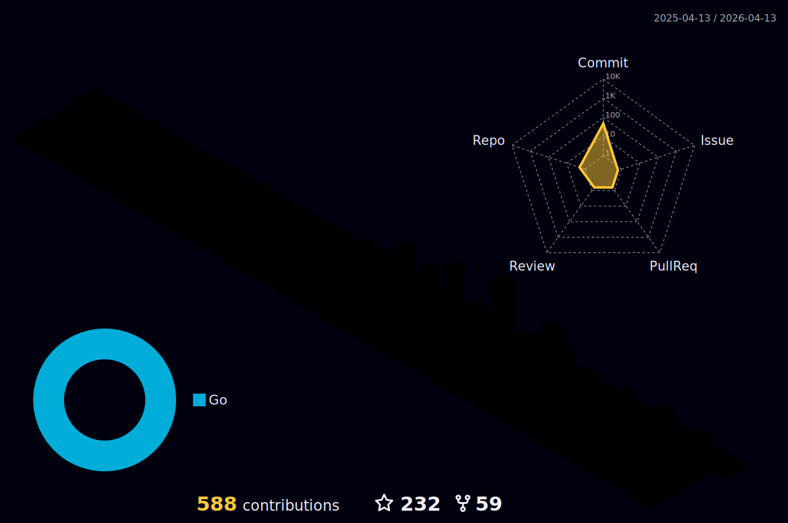

    

# Hello 👋, welcome to my GitHub profile!

I'm a software developer who is dedicated to learning and working on various aspects of this field, including the Spring framework, Microservices architecture, NoSQL, and RDMS in my daily life. My ultimate goal is to become a professional backend engineer capable of writing clean code, thanks to the education I've received and the experiences I've gained throughout my career.

## About Me

- 🔭 I'm currently working as a Software Developer.
- 👋 I primarily work with the `Java`, `Golang`, `Javascript` language.
- 🌱 I'm currently focused on learning backend technologies with Java and Go frameworks.
- 📫 You can reach me via [LinkedIn](https://www.linkedin.com/in/ali-canli/) or [Email](mailto:alicanli1995@gmail.com?subject=Hello).

## Technical Skills

- 💻 Java (11, 17)
- 💻 Golang 
- 💻 React JS
- 🛢️ NoSQL (MongoDB, Couchbase)
- 🛢️ SQL (PostgreSQL)
- 🌍 Microservices Architecture

## My Projects

I am currently actively working on projects that involve Java, Golang, and React JS. These projects are related to backend technologies, databases, and user interfaces.

If you would like to learn more about my projects or have any questions, please feel free to get in touch with me.

## Contact Me

You can reach out to me on the following platforms:

- LinkedIn: [Linkedin](https://www.linkedin.com/in/ali-canli/)
- Email: [alicanli1995@gmail.com](mailto:alicanli1995@gmail.com?subject=Hello)

Thank you for visiting my profile!

Connect with me :  </h2>

<h3 align="left">Languages and Tools:</h3>

    
    
     
    
     
    
     
     
     
     
    
           
     
     
     
     
     
     
     

