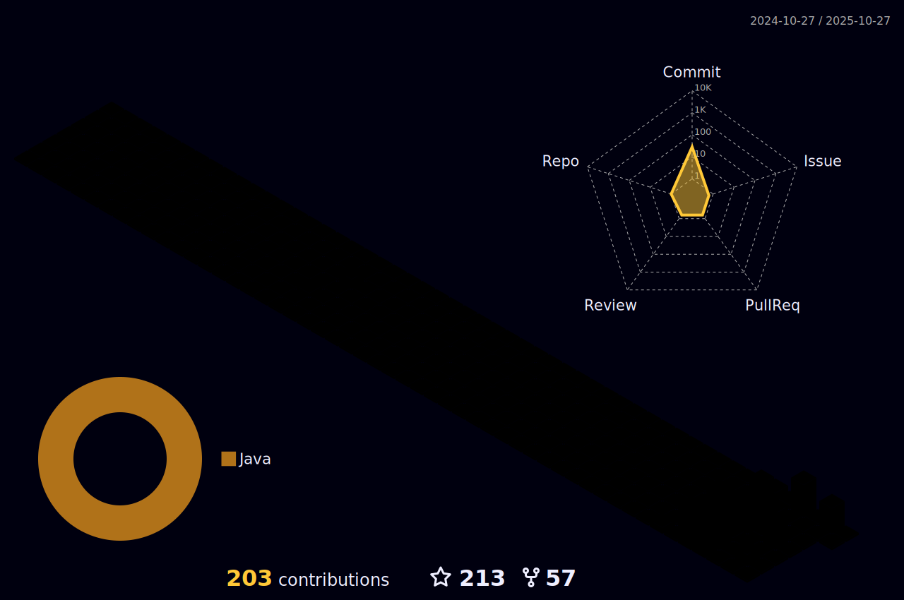

    

## Hello 👋 welcome my github profile :)

I am learning and working on trainings related to this field such as Spring framework, Microservices arthitecture , NoSQL, RDMS in my daily life. I want to become a professional backend engineer who writes clean code thanks to the education I received and the experiences I gained during the rest of my career.

- 🔭 I’m currently working on Java Software Developer.
- 👋 I'm currently working on `Java` languages
- 🌱 I’m currently learning Backend technology with Java and java's frameworks.
- 📫 How to reach me: [Linkedin](https://www.linkedin.com/in/ali-canli/) or [Mail](mailto:alicanli1995@gmail.com?subject=Hello)

Connect with me :  </h2>

<h3 align="left">Languages and Tools:</h3>

                          

